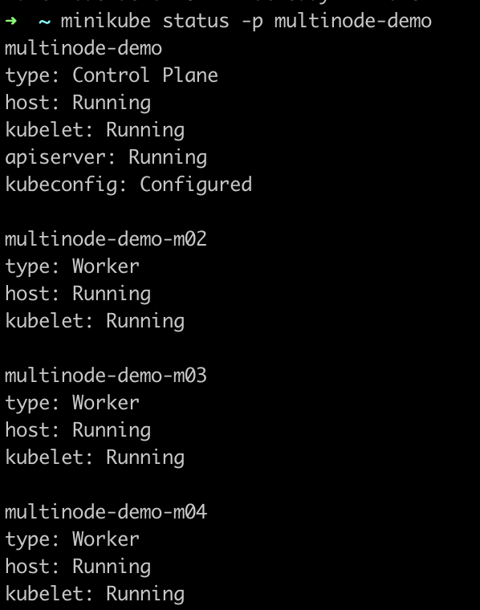
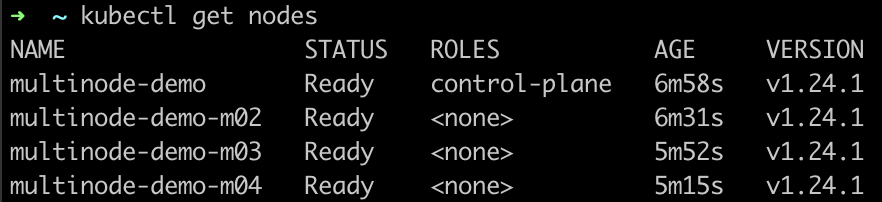

# minikube를 이용해 k8s multiNode 만들기

### 실행환경
+ MacBook Pro(16형, 2021년 모델)
+ Apple M1 Pro
+ macos Monterey 12.3.1(21E258)

### 멀티노드 구성방법
1. https://kubernetes.io/ko/docs/tasks/tools/install-kubectl-macos/ 를 참고해서, kubectl과 minikube를 설치해줍니다.
2. `minikube start --nodes 4 -p multinode-demo`
   1. --node는 노드의 갯수, -p는 profile을 의미합니다.
   2. 상당히 오래걸리는 작업입니다.
3. `minikube status -p multinode-demo`
   
    + 하나의 Control Plane, 3개의 Worker Node로 구성된 것을 알 수 있습니다.
4. `kubectl get nodes`
   

### minikube cluster삭제하기
1. `minikube delete --profile=multinode-demo`
